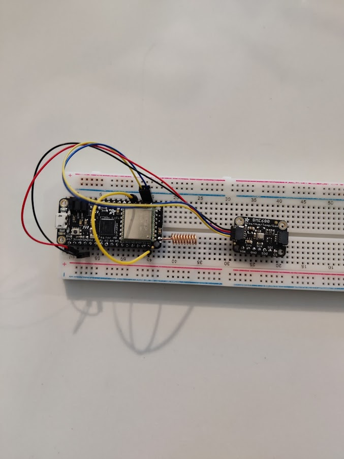

# LoRaWAN-Independent-Study
Jim Horwitz

Fall 2021 Semester

Advised by Nick Barendt, ISSACS

## Hardware Setup

Hardware used was an Adafruit Feather M0 with 900 MHz radio https://www.adafruit.com/product/3178 and Adafruit's BME680 temperature, humidity, altitude, and pressure sensor https://www.adafruit.com/product/3660

Here is a picture of the hardware setup:

Connections:

**Jumper io1 to Pin 6.** This is required for the callback function to work. Its unclear why, but when you remove the jumper, the callback function of the SendBuffer method is never called.

**Solder Pigtail Antenna to ant pin** Requied for the radio to work. Can also use three SMD pads for an external antenna at the bottom of the board.

**Use stemma wires from BME680 to I2C Pins of Feather** Required for communication between the feather and the BME680 board.

